# Fat Stack Coffee 

## Ecommerce Store 
*Version 1.0*
<hr>

### Click [me](https://fat-stack-coffee.herokuapp.com/) for live Site.
#### *Hosted on Heroku*

I recommend clicking any links found in this README with Ctrl + Left mouse click for (Windows) and Control + click (Mac).

# Project Overview

## Introduction

**Project Portfolio 5 - Ecommerce for  [CodeInstitute](https://codeinstitute.net/) Full-stack course (5P)**

I have created this full-stack application using the Python, Django framework, Heroku PostgreSQL as well as front end technologies, HTML, CSS and Javascript.

In addition to this, I made extensive use of git, Gitpod and Github functionality.

## Goals

The goal for this project, was to allow users to register and confirm email address, create a profile which would store user order information, order history and favourited products as well as being able to log back in and log out again.

Users also have the ability to browse filter and sort products by name, price and category.

As well as allow purchases of products themed around coffee, with different weights that are reflective of pricing, favouriting products to save for later this also includes making reviews for products.

Visitors to the site may also subscribe or unsubscribe to a newsletter provided by mailchimp, and receive a confirmation email with their order, visitors may also use the contact form provided in the contacts section to contact an administrator and get a response within 1-2 working days.

## Purpose

<br>

The projects purpose is to enable customers/registered users to make purchases, register an account and review products while enjoying smooth user experience and user interface.

## Project Future

<br>

This project has been built with the future in mind, post 1.0 release I am eager to implement further features, optimisation, new technologies, modernised design, styling improvements, added responsiveness and new features!

## Future Features

<br>

- Live chat
    - Customer Support

- Ajax Queries
    - Improved page loading

- Improved Products

- Subscription Model

- Ability to checkout in different Currencies

- Ability to change site language

- Dark/Light Theme

- Expanded user-profile

- FSC Blog
    - Comments
    - Likes

- Performance optimisation

- Bug Fixes

- Responsiveness Improvements

# User Experience

## UX

<br>

User experience has been designed with a minimalistic, clean and professional look.
A light coloured background and bold dark colours for text as well as sharp images to portray the purpose and goal of the ecommerce-site.

Customer can browse the site finding out more about featured products, as well as
find out more about the benefits of coffee, User can open facebook social links in a new tab, subscribe to a newsletter. Users have the ability to reach out to the site owner with the contact page as well as read more about the company on the about us page.


Users can also make payments via the checkout app using a credit/debit card via *[stripe](https://stripe.com/gb)* technology.

<br>

### Card Testing
Payment testing use information below.


<br>

## User Stories 


I have created my user stories and epics using an agile approach and would like to continue improving on this aspect in the future with newer and updated previous projects.

I am planning to expand my knowledge on user stories and epics in the future and greatly expand them.

Future user stories planned for next sprint review.

- As a customer I will experience greater performance on the site.

- As a site owner I can the same products with different colours in one product.

- As a customer I can enter my post code or zip code and can select my address from a drop down input.

- As a customer entering details I can see input validation while I am typing in my details so I can be reminded and correct them.

- As a site administrator I can further customise the admin panel to enable easier management of the site and products.

## Agile Methodology 


All Github issues and project was created according to the MoSCoW to allow to plan and reach a consensus on resource allocation on the project.

How to Create a Kanban Board project and steps taken. 

1. Open project repository
2. Navigate to issues
3. Create issue tags 
    1. 'Must have' (Most important features)
    2. 'Should have' (Should be implemented)
    3. 'Could have' (Implement if there is time)
    4. 'Won't have' (Features that have been outside of current scope)
4. Create Github Project(Non-BetaVersion)
    1. Use Kanban board style.
5. Create columns consisting of
    1. 'to do' (Work that needs to be done)
    2. 'In progress' (Feature in development)
    3. 'Done' (Feature complete and tested)
    4. 'Future content' (Content implemented post-release).
6. Assign issues to columns as project progresses and development continues, deciding along the journey.

<br>

## Significance and Complexity


7. All of the above have been Completed
    1. I have chosen Cloudinary over AWS as I am more comfortable with it.
8. I increased scope of the project after initial plannin, as I had more time than I expected.

<br>

## User Testing
<hr>

* My mentor gave me a feedback on design and styling of my project, which I had acted upon, improving padding across different templates as well as improving colour usage across the site.

* I have receieved feedback from fellow student Joanna Gorska, she gave me feedback about review button colours and some responsiveness improvements.

* I recieved feedback from code review channel on slack also by getting feedback on contact form not working as expected this has now been reworked and users should expect a reply within 1-2 working days.

* I was also given feedback about the footer and subscribe not being the same width to improve consistency this has also been resolved successfully.

* I asked my brother to test the site and he tested the site with an Iphone 13 Pro max as well as his desktop pc (2560x1440) he logged in with provided user details and tested purchasing an item as well as without an account, This test passed successfully.

* My friend tested my contact page form after bug fix and I can confirm that emails are being sent out to admin.

<br>

# Wireframes

### PC Wireframes
* [Desktop](documentation/wireframes/desktop)

### Laptop Wireframes
*   [Laptop](documentation/wireframes/laptop)

### Tablet Wireframes
*   [Tablet](documentation/wireframes/tablet)

### Mobile
*   [Mobile](documentation/wireframes/mobile)

<br>

# Database Models 

## fsc_users app model structure (UserProfile)
<hr>

```py
class UserProfile(models.Model):
"""
A user profile model for maintaining default
delivery information and order history
"""
user = models.OneToOneField(
    User,
    on_delete=models.CASCADE
)
default_phone_number = models.CharField(
    max_length=20,
    null=True,
    blank=True
)
default_street_address1 = models.CharField(
    max_length=80,
    null=True,
    blank=True
)
default_street_address2 = models.CharField(
    max_length=80,
    null=True,
    blank=True
)
default_town_or_city = models.CharField(
    max_length=40,
    null=True,
    blank=True
)
default_county = models.CharField(
    max_length=80,
    null=True,
    blank=True
)
default_postcode = models.CharField(
    max_length=20,
    null=True,
    blank=True
)
default_country = CountryField(
    blank_label='Country',
    null=True,
    blank=True
)

def __str__(self):
    return self.user.username

@receiver(post_save, sender=User)
def create_or_update_user_profile(sender, instance, created, **kwargs):
    """
    Create or update the user profile
    """
    if created:
        UserProfile.objects.create(user=instance)
    # Existing users: just save the profile
    instance.userprofile.save()
```

## fsc_contact app model structure (Contact)
<hr>

```py
class Contact(models.Model):
    email = models.EmailField()
    subject = models.CharField(max_length=255)
    message = models.TextField()

    def __str__(self):
        return self.email
```

## fsc_checkout app model structure (Order, OrderLineItem)
<hr>

```py
class Order(models.Model):
    """
    Model saves instances with user and purchase information.
    """
    order_number = models.CharField(
        max_length=32,
        null=False,
        editable=False
    )
    user_profile = models.ForeignKey(
        UserProfile,
        on_delete=models.SET_NULL,
        null=True,
        blank=True,
        related_name='orders'
    )
    full_name = models.CharField(
        max_length=50,
        null=False,
        blank=False
    )
    email = models.EmailField(
        max_length=254,
        null=False,
        blank=False
    )
    phone_number = models.CharField(
        max_length=20,
        null=False,
        blank=False
    )
    country = CountryField(
        blank_label='Country *',
        null=False,
        blank=False
    )
    postcode = models.CharField(
        max_length=20,
        null=True,
        blank=True
    )
    town_or_city = models.CharField(
        max_length=40,
        null=False,
        blank=False
    )
    street_address1 = models.CharField(
        max_length=80,
        null=False,
        blank=False
    )
    street_address2 = models.CharField(
        max_length=80,
        null=True,
        blank=True
    )
    county = models.CharField(
        max_length=80,
        null=True,
        blank=True
    )
    date = models.DateTimeField(
        auto_now_add=True
    )
    delivery_cost = models.DecimalField(
        max_digits=6,
        decimal_places=2,
        null=False,
        default=0
    )
    order_total = models.DecimalField(
        max_digits=10,
        decimal_places=2,
        null=False,
        default=0
    )
    grand_total = models.DecimalField(
        max_digits=10,
        decimal_places=2,
        null=False,
        default=0
    )
    original_cart = models.TextField(
        null=False,
        blank=False,
        default=''
    )
    stripe_pid = models.CharField(
        max_length=254,
        null=False,
        blank=False,
        default=''
    )

    def _generate_order_number(self):
        """
        Function generates a randomised unique
        order number using UUID
        """
        return uuid.uuid4().hex.upper()

    def update_total(self):
        """
        Update grand total each time a line item is added,
        accounting for delivery costs.
        """

        self.order_total = self.lineitems.aggregate(
            Sum('lineitem_total'))['lineitem_total__sum'] or 0
        if self.order_total < settings.FREE_DELIVERY_THRESHOLD:
            sdp = settings.STANDARD_DELIVERY_PERCENTAGE
            self.delivery_cost = self.order_total * sdp / 100
        else:
            self.delivery_cost = 0
        self.grand_total = self.order_total + self.delivery_cost
        self.save()

    def save(self, *args, **kwargs):
        """
        Override the original save method to set the order number
        if it hasn't been set already.
        """
        if not self.order_number:
            self.order_number = self._generate_order_number()
        super().save(*args, **kwargs)

    def __str__(self):
        return self.order_number


class OrderLineItem(models.Model):
    """
    Model to save each item in an Order instance as a lineitem.
    """
    order = models.ForeignKey(
        Order,
        null=False,
        blank=False,
        on_delete=models.CASCADE,
        related_name='lineitems'
    )
    product = models.ForeignKey(
        Product,
        null=False,
        blank=False,
        on_delete=models.CASCADE
    )
    product_weight = models.CharField(
        max_length=50,
        null=True,
        blank=True
    )
    quantity = models.IntegerField(
        null=False,
        blank=False,
        default=0
    )
    lineitem_total = models.DecimalField(
        max_digits=6,
        decimal_places=2,
        null=False,
        blank=False,
        editable=False
    )

    def save(self, *args, **kwargs):
        """
        Override the original save method to set the lineitem total
        and update the order total.
        """
        self.lineitem_total = self.product.price * self.quantity
        super().save(*args, **kwargs)

    def __str__(self):
        return f'SKU {self.product.sku} on order {self.order.order_number}'

```

## fsc_products app model structure (Category, Products, Review, FavouritesList)
<hr>

```py
class Category(models.Model):
    """
    The Category model class, with fields for the category name.
    """
    class Meta:
        """
        Meta class to return plural name of category.
        """
        verbose_name_plural = 'Categories'

    name = models.CharField(max_length=254)
    friendly_name = models.CharField(
        max_length=254,
        null=True,
        blank=True
    )

    def __str__(self):
        """
        Returns the category name as string.
        Args:
            self (object)
        Returns:
            The category name field as string
        """
        return self.name

    def get_friendly_name(self):
        """
        Returns the user readable category name as string.
        Args:
            self (object)
        Returns:
            The category friendly name string
        """
        return self.friendly_name


class Product(models.Model):
    """
    The Product model class, used to generate an instance of a product
    """
    category = models.ForeignKey('Category', null=True, blank=True,
                                 on_delete=models.SET_NULL)
    sku = models.CharField(
        max_length=254,
        null=True,
        blank=True
    )
    name = models.CharField(
        max_length=254
    )
    description = models.TextField()
    coffee_amounts = models.BooleanField(
        default=False,
        null=True,
        blank=True
    )
    price = models.DecimalField(
        max_digits=6,
        decimal_places=2
    )
    image_url = models.URLField(
        max_length=2024,
        null=True,
        blank=True
    )
    image = models.ImageField(
        max_length=2024,
        null=True,
        blank=True
    )
    
    def __str__(self):
        """
        Returns the product name
        Args:
            self (object)
        Returns:
            The product name field as string
        """
        return self.name

    def get_rating(self):
        total = (sum(int(review['star_rating']) for review
                 in self.reviews.values()))

        if self.reviews.count() > 0:
            return total / self.reviews.count()
        else:
            return 0


class Review(models.Model):
    """
    The review model class, with fields for
    user and products using a foreign key (unique value)
    A prod_description and review_time
    """

    user = models.ForeignKey(UserProfile, related_name='reviews',
                             on_delete=models.CASCADE)
    product = models.ForeignKey(Product, related_name='reviews',
                                on_delete=models.CASCADE)
    description = models.TextField(max_length=450, null=False,
                                   blank=False)
    star_rating = models.IntegerField(validators=[
            MaxValueValidator(5),
            MinValueValidator(1)
        ])
    review_time = models.DateTimeField(auto_now_add=True)


class FavouritesList(models.Model):
    """
    Class based model for storing users favourited items.
    """
    user = models.OneToOneField(
        User,
        on_delete=models.CASCADE
    )
    product = models.ManyToManyField(
        Product,
        blank=True
    )
```

* The database models above populate the database and perform their functions as expected.

    * User - Django built in User model with basic information.

    * Category - Products are grouped with categories.

    * Product - Product model for displaying models.

    * Contact - Contact model displays contact form and sends mail.

    * Review - Review model to enable users to make reviews and rate products.

    * Order - When a user makes a successful purchase, an instance of the Order model is created, which stores delivery and user information.

    * OrderLineItem - a model that holds product information for a particular product and connects the product model and the order model.

    * UserProfile - Model storing users personal and order information.

    * FavouritesList - A Model that handles creating a list of products that a user has saved, which appears in the users profile page as a list.

## Database Schema
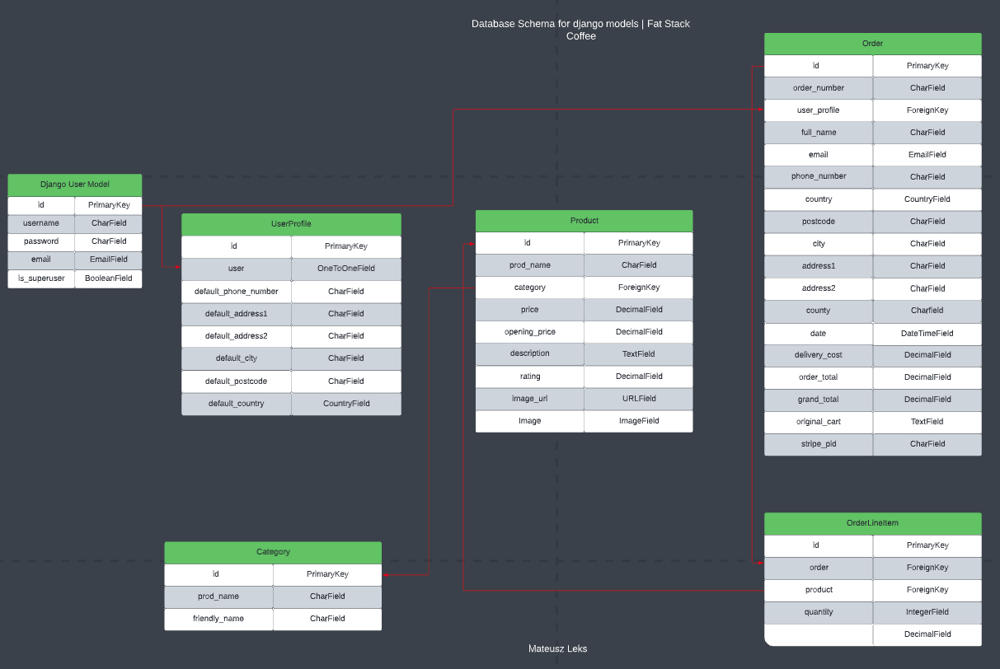

My Schema of models used in this application made with lucidchart it was created at project conception and I have added after contact, reviews, rating and favourites models.

# Project Design

## Composition


### Fonts
<hr>

* Heading Fonts:
    * I have used Lato for my heading fonts as I like the style of this font and I feel like it compliments my project design.

<hr>

* Body Text Fonts:
    * I have used Montserrat as this font style goes with Lato and I feel like they work well together in the purpose of this website.

<hr>

* Font size:
    * has been kept to mostly default with css and otherwise handled by bootstrap 5

<hr>

### Color Scheme

* The idea for the site is minimalistic and clean

* Color: #000000
    * I have chosen this color for my headings as to keep them minimalistic and visible.
    * This colour is also used for button-custom background.
    * as well as profile background form
    * I am using #000000 for hovers on the main navbar to create an animation and indicate to users what they are hovering over

* Color: #ffffff 
    * This colour is used for the site background as well as white text on button-custom
    * Delivery message at the top of the screen

* Color: #e9ecef
    * This colour is used by the mail chimp signup form to make it stand out.
    * as well as the footer links.

* Color: #68bb7d
    * This colour is used for the footer a:hover links
    and list hover

* Color: #00008B
    * This colour is used for when the cart has products inside.

* Color: #212934 
    * This colour is used to create the hover effect for the footer icons

* Color: #dc3545 Is used for custom checkboxes in products form.

### Color Contrast Grid

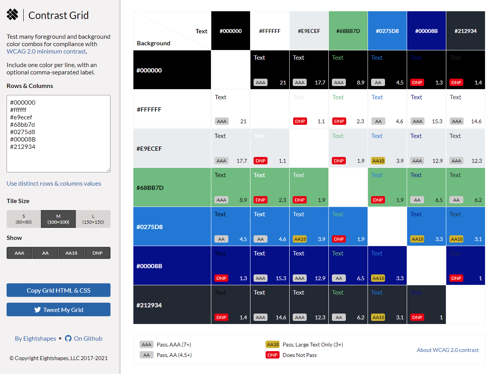

# Project Features

## Home Page

### Main navbar


* Easy to navigate with the main navbar with clear colours, function and design made with Bootstrap5.

### Carousel & filter nav


* Carousel is used on the home page with 3 automatically scrolling images on the right with educational and inspirational text on the left.

### Featured products


* Featured products section shows two coffees that are featured as well as a coding mug to entice coders to purchase a product as well as helping bring attention to potentially good products

### Newsletter


* Mailchimp newsletter allows users to subscribe on unsubscribe and recieve an email with 2-3 days.

### Footer and social links


* Footer includes links to products as well as links to the sites other pages in addition it contains contact details.

## Products Page

### Products view

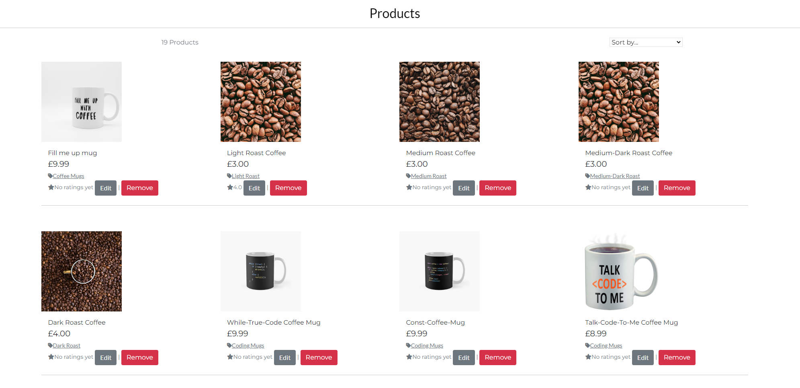

* Products view image is an admins version of products view, non super-users will not have the ability to edit or delete products, this area shows product name, price, category, image (placeholder if none), and allowing users to click on the image to be taken to the product details page.

### Products detail

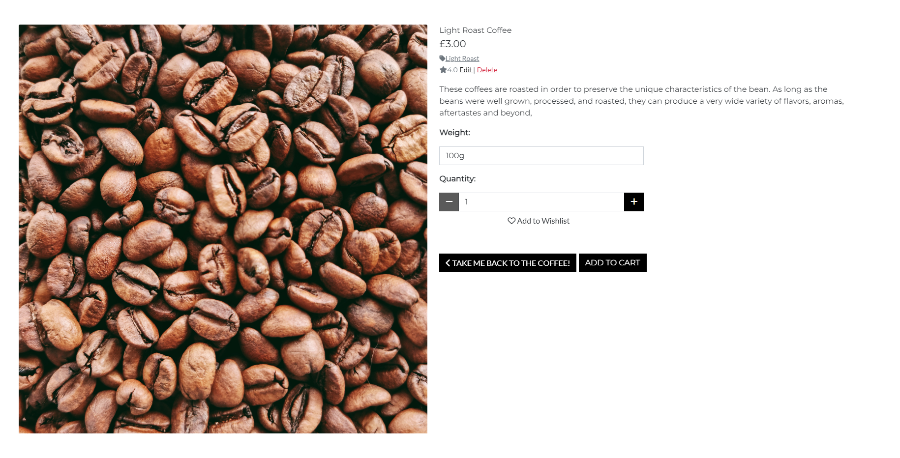

* Product details page shows an enlarged product image for improved viewing, product name, price, how good the ratings are, a product description, product weight drop down, products quantity selectors as well as a go back button and add to cart button.

### Add product


* Add product page contains form fields for adding products.

### Edit product

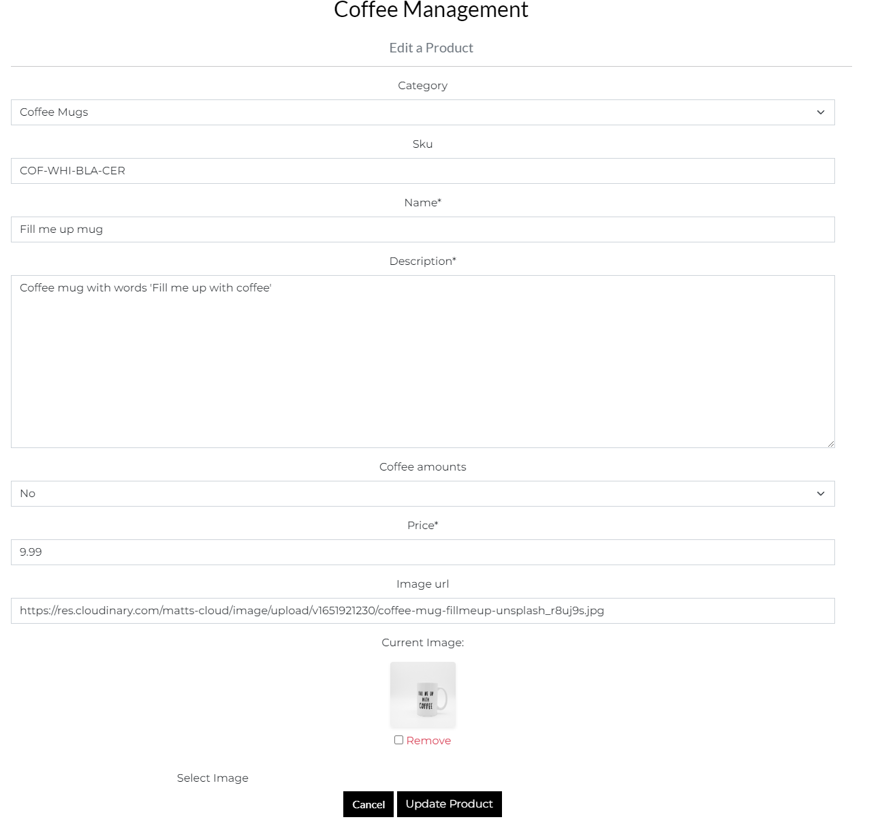

* Edit product page contains form fields for edditing products.

### Add review

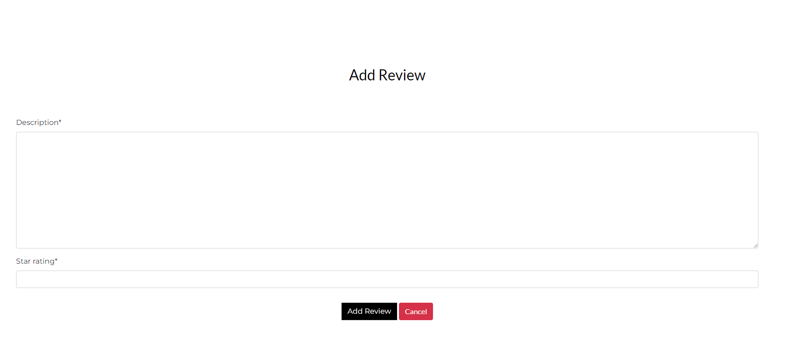

* Add review page contains content and a star rating to rate and review product.

### Reviews


* User review section shows a user review with a rating and content as well as username.

## Checkout

### Shopping cart

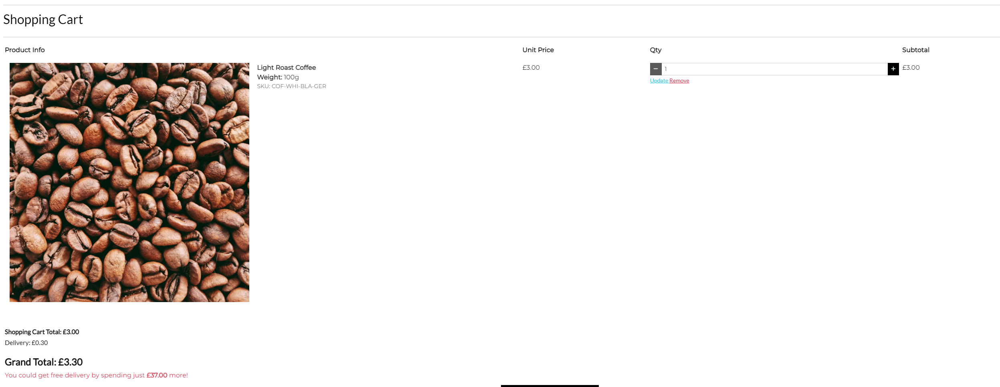

* Shopping cart page shows products added to cart as well as details about the products and also allows the user to change product quantity as well as see unit price, subtotal and grand totla as well as go to checkout button.

### Order summary


* Order summary page shows products that are in cart and the total price, as well as form fields to checkout using stripe with a country fields drop down box and secure checkout button.

### Checkout successful

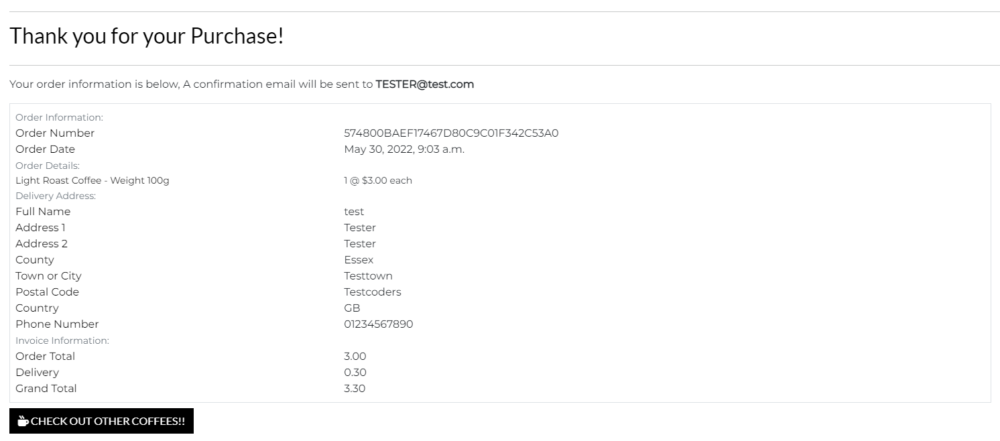

* This page shows an invoice after a successful purchase displaying order information and order number with a button to check out other products.

## Profiles page

### Profile favourites list order history


* Profiles page shows favourites, order history and personal details.

## About Page

### Fat stack coffee ethos


* Fat stack coffee company ethos with thumbnail image

### Fat stack coffee services


* Fat stack coffee company services animated with font awesome animations.

## Contact Page

### Fat stack coffee google maps location


* Google map embbeded with location using html.

### Fat stack coffee contact form

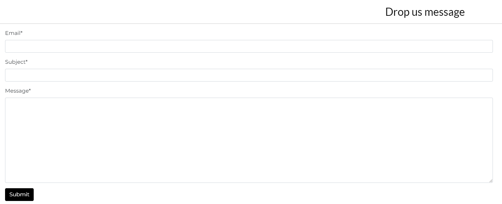

* Fat stack coffee company Contact form allowing users to contact an administrator.

### Fat stack coffee contact details


* Contact details display when the shop is open and address.

## Allauth

### Sign in

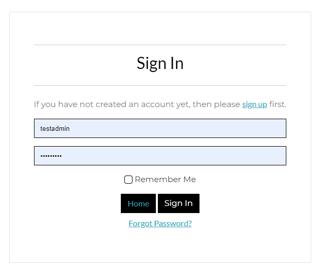

* Allows user to sign in or reset password.

### Sign out


* Allows user to sign out and asks to confirm.

### Sign up


* Allows users to register an account.


# Code Validation

## HTML

### Beautify

* I used HTML Beautify to help improve layout of html jinja templates this also formats code for better viewing.

### Nu Html Checker

* HTML Validation using [nu-html](documentation/validation_docs/nu_html) - all passed!
    * Only error encountered was an issue with mailchimp in the footer if followed instructions breaking mailchimp (Mailchimp code).


## CSS

### Jigsaw

* Project Level [base.html](documentation/validation_docs/fat_stack_coffee/jigsaw_css) - all passed!

* fsc_users [user_profile.css](documentation/validation_docs/fsc_users/jigsaw_css) - all passed!

* fsc_checkout [checkout.css](documentation/validation_docs/fsc_checkout/jigsaw_css) - all passed!

* fsc_contact [contact.css](documentation/validation_docs/fsc_contact/jigsaw_css) - all passed!

## Javascript

### Jshint

* Product detail and Products [template](documentation/validation_docs/fsc_product/jshint) - all passed!

* fsc_users [stripe_elements](documentation/validation_docs/fsc_users/jshint) - all passed!

* fsc_checkout [country_fields](documentation/validation_docs/fsc_users/jshint) - all passed!

## Python

### Pep8

* [Project level ](documentation/validation_docs/fat_stack_coffee) - all passed!

* [fsc_cart](documentation/validation_docs/fsc_cart) - all passed!

* [fsc_checkout](documentation/validation_docs/fsc_checkout) - all passed!

* [fsc_contact](documentation/validation_docs/fsc_contact) - all passed!

* [fsc_product](documentation/validation_docs/fsc_product) - all passed!

* [fsc_users](documentation/validation_docs/fsc_users) - all passed!

# Technologies Used
  * Coding Languages

    * [HTML5](https://en.wikipedia.org/wiki/HTML5). - Site structure.

    * [CSS3](https://en.wikipedia.org/wiki/CSS). - Site Design.

    * [Python3.2](https://en.wikipedia.org/wiki/Python_(programming_language)). - Used with Django.

    * [Javascript](https://www.javascript.com/) - Used mainly for front-end tweaking of numbers especially quantity and pricing.

* Libraries, Frameworks & Tools

  * [Django](https://www.djangoproject.com/) - Framework used to build the site and admin page.

  * [HerokuSQL](https://www.heroku.com/postgres) - Database used in the project.

  * [Python OS](https://docs.python.org/3/library/os.html). - Used for ```os.environ``` to help with automated development ```DEBUG```

  * [Markdown](https://en.wikipedia.org/wiki/Markdown). - Used for creating README.md document.

  * [Bootstrap 5](https://getbootstrap.com/). - Used for styling the site a framework addition to CSS3.

  * [Stripe](https://stripe.com/gb) - Handling Payments

  * [jQuery](https://jquery.com/) - Minimising Code

  * [Font Awesome](https://fontawesome.com/)- Used for icons and their animations

  * [Django Allauth](https://django-allauth.readthedocs.io/en/latest/installation.html) - Used to handle user authentication

  * [Sending Mail](https://docs.djangoproject.com/en/3.2/topics/email/) - Used in conjunction with gmail for sending mail from contact to user

  * [Gmail](https://mail.google.com/mail) - Used to acquire app password

* Hosting Technologies

  * [Heroku](https://dashboard.heroku.com/login). - Deployment and hosting environment.

  * [Cloudinary](https://cloudinary.com/). - Storing images and static files.

  * [Github](https://github.com/). - Hosting Repository code.

* Testing Technologies

  * [Nu Html Checker](https://validator.w3.org/nu/#textarea). - Validate HTML.

  * [W3C CSS3](https://jigsaw.w3.org/css-validator/). - Validate CSS.

  * [DiffChecker](https://www.diffchecker.com/#). - Comparing code changes.

  * [Pylint](https://pylint.org/). - Analysing python code.

  * [Beautify](https://htmlbeautify.com/) - Improving layout of html templates.


# SEO Research and Implementation

## SEO Research

### Marketing research
Code Institute, Lesson Excercise

* Who are your users?
    * Coders.

    * Developers.

    * Coffee Drinkers.

    * Nerds.

* Which online platforms would you find lots of your users?

    * Twitter.

    * Reddit.

    * Slack.

    * Instagram.

    * Facebook.

    * Forums.

* Would your users use social media? If yes, which platforms do you think you would find them on?

    * Twitter.

    * Reddit.

    * Slack.

    * Instagram.

    * Facebook.

    * Forums.

* Would your business run sales or offer discounts? How do you think your users would most like to hear about these offers?

    * Run sales during months with high engagements to keep increasing customer base.
    Email marketing/newsletter.
    Pop up ads.

* What are the goals of your business? Which marketing strategies would offer the best ways to meet those goals?

    * Goals of the business is to make buying high quality coffee easier for busy developers.

    * Ease of use across the site.

    * Increasing customers value.

    * Boosting brand engagement.

    * Acquire new customers.

    * Increasing brand awareness.

* Would your business have a budget to spend on advertising? Or would it need to work with free or low-cost options to market itself?

    * At the beginning the business would need to focus on free advertisement
    And market itself
    Once the business picks up the budget could increase according to the buinesss revenue.


### Keyword Research

* What do your users need?
    * My users need a product “coffee” for their daily work because they are coders who typically spend a long time infront of a computer screen and it may help them with a high quality coffee.

* What information and features can you provide to meet those needs?

    * Add to cart button, product description, volume of product, pricing, product search.

* How can you make the information easy to understand?

    * Clear font and font colours as well as a accessible colour scheme across site.	

* How can you demonstrate expertise, authoritativeness and trustworthiness in your content?

    * Keep content up to date

    * Wikipedia page

    * User reviews

    * Hire experts

    * Trusted sources

    * Contact details

* Would there be other pages within your own site you could link to from your chosen page?
    * Index *page*

    * Footer *all/pages*

    * About us *page*

    * Contact *page*

    * Accounts *page*

* Are there opportunities to link back to external websites that already rank highly on Google?

    * Facebook

    * Github

    * Linkedin

    * Wikipedia

* How can you help users discover other relevant parts of your web application?

    * Clear navigation on the site
    with the use of a navigation bar
    and social links that open in another tab


### SEO Keywords
<hr>

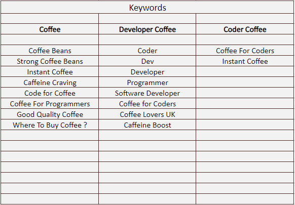


# Web Marketing 

## Newsletter

I have used a newsletter from mailchimp where users will get a welcome email within a few days as I am on the free plan this may be quicker or slower depending on service. 
Users can subscribe or unsubscribe whenever they wish.

## Facebook business page

Fat stack coffee is on has a facebook business page for marketing and research purposes as well as to post and advertise, create engaging content and attract visitor and customers.


<hr>


<hr>

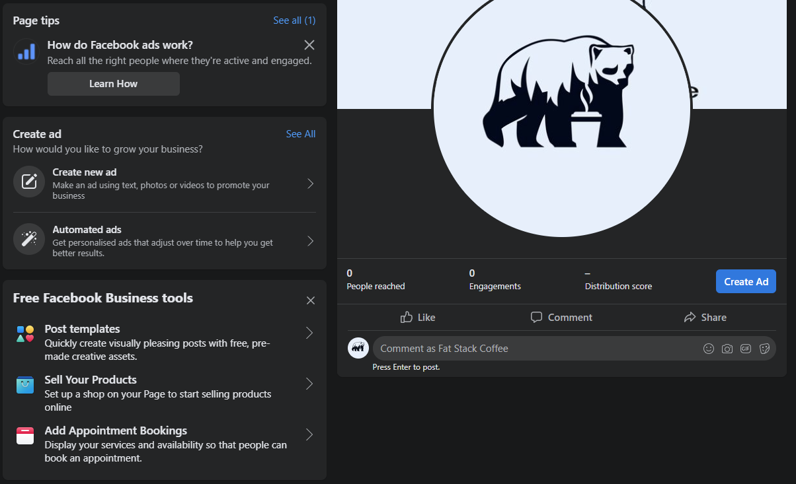
<hr>

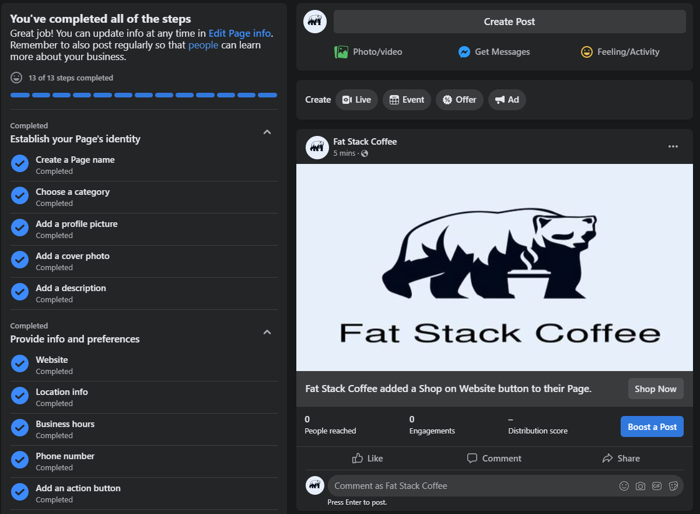
<hr>

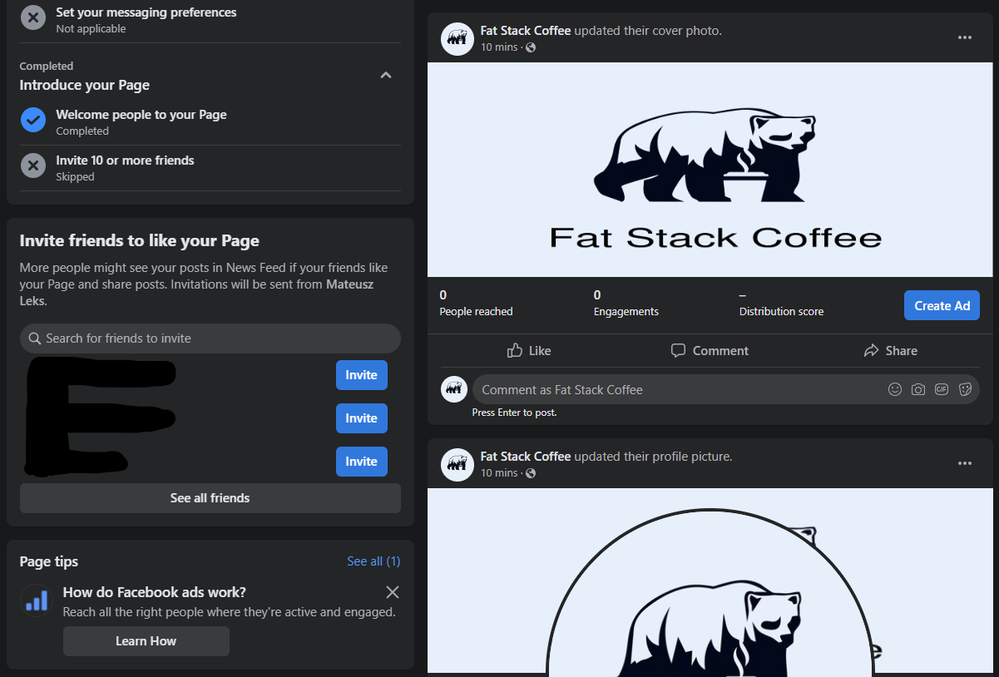
<hr>


<hr>


# Bug report

## Squashed bugs

1. MultidictKeyerror.
    * Cause = more than 1 superuser with same email.
    * Fix = Ensure only 1 user with same email

2. NoReverseMatch.
    * Cause = Incorrect url
    * Fix = Repair url link and urls.py path

3. Unsubscribe button mailchimp
    * Cause = Unknown/Error with MC source code
    * Fix = Remove element

4. Sorting via star rating
    * Cause = Unknown/Views
    * Fix = Disable sorting via ratings

5. Cloudinary Media/Static images with relative paths
    * Cause = Cloudinary Bug
    * Fix = Use cloudinary links for images in production.
    * Fix = None

6. Circular import error fsc_reviews/fsc_products
    * Cause = Circular import
    * Fix = Move fsc_reviews model and views to fsc_products app.

7. Imagefield not working
    * Cause = Max_length too low
    * Fix = Increase Max_length, migrate.

8. Weight not changing price products
    * Cause = Not enough login
    * Fix add javascript to product_details page


## Remaining bugs

* None reported as of 1.0 release

## Security 

  I have set debug to be automatic using the following.
  * settings .py
      ```
      SECURITY WARNING: don't run with debug turned on in production!

      DEBUG = "DEVELOPMENT" in os.environ
      ```
  * env.py
      ```
      os.environ["DEVELOPMENT"] = "True"
      ```
  * urls.py
      
      ```
      from django.conf import settings

      from django.conf.urls.static import static

      urlpatterns = [ path(...... ] + static(settings.STATIC_URL, document_root=settings.STATIC_ROOT)
      ```

# Deployment

## Cloning Project with Github
  **[Repository Link](https://github.com/Matex600/Fat-Stack-Coffee)**

  * Create Account with Github

  * Login To Github account.
  
  * Access my repository using the above link.

  * In the File menu, click Clone Repository.
    * Search for repo
    * Or 
  * In the repository page select code next to Gitpod.

  * Button, make sure HTTPS is selected.

  * Click on the copy button on the right (Two overlapping squares)

  * Open a new workspace in Gitpod.

  * Once the workspace loads in the terminal type.
        ```
        git clone https://github.com/Matex600/Fat-Stack-Coffee
        ```

## Forking Project Via Github

* To Fork and continue working on the project without affecting the main branch follow steps outlined below.

    1. Navigate to github repositores select this **[repository](https://github.com/Matex600/Fat-Stack-Coffee)**.

    2. Navigate to top right of the web page and click on **Fork**.

    3. After this has been done a fork will be created for you to use!

## Deployment via Heroku

  * Development Environment
    1. Create Github Account
        * Login
        * Create project using Code Institutes **[Project](https://github.com/Code-Institute-Org/gitpod-full-template)**  template.
        * Open workspace using gitpod button, Only do this once.
        * Install required dependancies.
        <hr>

        ```
            asgiref==3.5.0
            cloudinary==1.29.0
            crispy-bootstrap5==0.6
            dj-database-url==0.5.0
            dj3-cloudinary-storage==0.0.6
            Django==3.2
            django-allauth==0.41.0
            django-countries==7.2.1
            django-crispy-forms==1.14.0
            django-jazzmin==2.5.0
            gunicorn==20.1.0
            oauthlib==3.2.0
            Pillow==9.1.0
            psycopg2-binary==2.9.3
            python3-openid==3.2.0
            pytz==2022.1
            requests-oauthlib==1.3.1
            sqlparse==0.4.2
            stripe==3.0.0
        ```
        <hr>

        * In gitpod terminal use code 

        <br>

        ```
        pip3 freeze > requirements.txt

        ```
        <hr>

        * This will create a requirements file used by Heroku

        * Create Procfile containing application name and ensure proper formatting or else deployment will fail..

        ``` 
        web: gunicorn app_name_goes_here.wsgi:application 
        ```

    2. Create env.py it needs to contain these 9 variables.

      * Cloudinary can be obtained here [URL](https://cloudinary.com/)

      * Secret key is a password of your choosing make it a strong one [KEY](https://djecrety.ir/)

      * Obtain Heroku postgreSQL [HERE](https://dashboard.heroku.com/apps)

      * Obtain Stripe Keys [Here](https://stripe.com/gb)

        * Stripe public and secret key found under Developers tab
        * Stripe Wh Secret found when creating Webhook

      * EMAIL_HOST_USER = Gmail, Email address

      * EMAIL_HOST_Pass = Gmail, App Password

        * Create [App](https://devanswers.co/create-application-specific-password-gmail/) password

        ```
            import os

            os.environ['DATABASE_URL'] = 'postgres:// '...'

            os.environ['SECRET_KEY'] = '...'

            os.environ["DEVELOPMENT"] = "True"

            os.environ['CLOUDINARY_URL'] = '...'

            os.environ["STRIPE_PUBLIC_KEY"] = "..."

            os.environ["STRIPE_SECRET_KEY"] = "..."

            os.environ["STRIPE_WH_SECRET"] = "..."

            os.environ["EMAIL_HOST_PASS"] = "..."

            os.environ["EMAIL_HOST_USER"] = "..."
        ```
        * Add these in to Heroku Variables as well

        <br>

        

    3. Create Procfile containing application name to ensure proper formatting or deployment will fail.

    4. Commit and push changes to Github.

    5. Move to Heroku part of deployment.

    6. Create an account with [Heroku](https://signup.heroku.com/).

    7. Create a new app
        * Choose region
        * Choose appropriate app name
        * Add app name to Procfile

    8. In **Resources** add **Heroku Postgres** hobby plan.

    9. Within your newly created app
    go to settings go to **Config Vars**
    use the **DATABASE_URL** Value and add it to your env.py file and connect it via settings.py.

        ```
        import dj_database_url
        if os.path.isfile('env.py'):
        """
        Conditional import to prevent application
        error if it cannot find env
        """
        import env
        ```

        ```
        if 'DATABASE_URL' in os.environ:
            DATABASES = {
            'default': dj_database_url.parse(os.environ.get('DATABASE_URL'))
            }

        else:
         DATABASES = {
            'default': {
            'ENGINE': 
            'django.db.backends.sqlite3',
            'NAME': BASE_DIR / 'db.sqlite3',
            }
        }
        ```

    10. Create a **SECRET_KEY** Key and the Value as the desired key.
        * Add to env.py

    11. Next go to the **Deploy** tab next to **Deployment Method** click **GitHub** connect your account and repository.
        * You may choose manual deployment **[Here](https://devcenter.heroku.com/articles/heroku-cli)** Using Heroku Cli

    12. I **Recommended** enabling automatic deploys as it makes the process much easier and you update Github and Heroku at the same time.

    13. At the bottom of the page click deploy branch making sure it is set to **main** / **master**

    #### **Note.**

    This project uses Python and has to be deployed with a hosting platform such as Heroku as it handles backend functionality.

# Credits

## Media

All of these images below have been acquired for non-commercial use and for education and teaching purposes only I do not intend to profit from said images.

* [Site Bear Logo](https://www.creativefabrica.com/) I purchased this logo from Creative fabrica and have a license to use it.

## Product Images

* [Placeholder Produt Image](https://nayemdevs.com/changing-the-default-thumbnail-placeholder-of-woocommerce-product-is-easy/) (No Image for Product) this Image was procured from Nayemdevs.com

* [Hario Medium Glass Hand Coffee Grinder](https://www.amazon.co.uk/Hario-Medium-Coffee-Grinder-Ceramic/dp/B001802PIQ)

* [De'Longhi, Coffee grinder KG79, Black](https://www.amazon.co.uk/DeLonghi-KG79-Professional-Burr-Grinder/dp/B002OHDBQC?th=1)

* [De'Longhi KG210 Electric Coffee Grinder, Stainless Steel, Black](https://www.amazon.co.uk/DeLonghi-KG210-Capacity-Stainless-Adjustable/dp/B07YZWZCF9?th=1)

* [BODUM Bistro Blade Electric Coffee Grinder, Black](https://www.johnlewis.com/bodum-bistro-blade-electric-coffee-grinder-black/p5153737)

* [Smeg BCC02 Bean To Cup Coffee Machine, Black](https://www.johnlewis.com/smeg-bcc02-bean-to-cup-coffee-machine/black/p5599733?sku=240100409&irclickid=0t631OQ1dxyIWMgyNtyDcWtLUkDxhDQZh3ZeRY0&irgwc=1&tmcampid=99&s_afcid=af_1226424&Ptype=af_Subnetwork%20-%20Content)

* [Dedica Style EC685.M Pump Espresso Coffee Machine](https://www.delonghi.com/en-gb/pump-espresso-coffee-machine-dedica-ec685-m/p/EC685.M?awc=25781_1653493308_a216d00df8edcd978321a803be9969bd&utm_source=aw&utm_medium=affiliation_uk&utm_campaign=immediate.co.uk)

* [Smeg ECF01CR Coffee Machine, Cream](https://www.johnlewis.com/smeg-ecf01-coffee-machine/p3081576?irclickid=0t631OQ1dxyIWMgyNtyDcWtLUkDxhDzNh3ZeRY0&irgwc=1&tmcampid=99&s_afcid=af_1236178&Ptype=af_Content%20-%20Media)

* [Nintendo 64 Logo Mug](https://www.geekcore.co.uk/collections/coffee-travel-mugs/products/nintendo-64-logo-mug)

* [MMO Mug - Legendary Coffee Mug Level 110](https://www.amazon.co.uk/MMO-Mug-Legendary-Coffee-Ceramic/dp/B07TJZJ996)

* [LBS4ALL Charmander Coffee 11oz Pokemon Parody Ceramic Mug](https://www.amazon.co.uk/LBS4ALL-Charmander-Pokemon-Starbucks-Ceramic/dp/B07F6ZPRDR/ref=asc_df_B07F6ZPRDR/?tag=googshopuk-21&linkCode=df0&hvadid=345559925731&hvpos=&hvnetw=g&hvrand=7628739590917426292&hvpone=&hvptwo=&hvqmt=&hvdev=c&hvdvcmdl=&hvlocint=&hvlocphy=9045006&hvtargid=pla-844102480797&psc=1)

* [Grim Fandango Mug](https://www.etsy.com/uk/listing/1045511369/grim-fandango-mug-perfect-gamer-gift?gpla=1&gao=1&&utm_source=google&utm_medium=cpc&utm_campaign=shopping_uk_en_gb_d-home_and_living-kitchen_and_dining-drink_and_barware-drinkware-mugs&utm_custom1=_k_Cj0KCQjwhLKUBhDiARIsAMaTLnFarMhN0PejPLWlLjYNM_93nQEMDFLIWLbQp4MrVrLulClLuRB5o4saAkYvEALw_wcB_k_&utm_content=go_12603364216_125103423732_508660996287_aud-463075091998:pla-498657395952_c__1045511369engb_556156514&utm_custom2=12603364216&gclid=Cj0KCQjwhLKUBhDiARIsAMaTLnFarMhN0PejPLWlLjYNM_93nQEMDFLIWLbQp4MrVrLulClLuRB5o4saAkYvEALw_wcB)

* [Developer Handwritten Code](https://www.redbubble.com/i/mug/Developer-Handwritten-Code-Black-BG-Short-by-yalco-dev/58005207.9Q0AD)

* [Programming Mug - If Not Empty Drink Else Refill Mug](https://www.redbubble.com/i/mug/Programming-Cup-Mug-If-Not-Empty-Drink-Else-Refill-by-Goodsauce/69271140.9Q0AD)

## Site-Wide Images

Procured from

* [Unsplash](https://unsplash.com/)
* [Pexels](https://www.pexels.com/)

## Technology Acknowledgments

* [Ecommerce Inspiration](https://youtu.be/_ELCMngbM0E) - This Video by Dennis Ivy gave me inspiration on how to create this application.

* [Intro To Python Programming: Beginners](https://www.amazon.co.uk/Intro-Python-Programming-Beginners-Guide/dp/B09VW7ZMY5/ref=sr_1_1?keywords=john+elder&qid=1653832841&sr=8-1) - Helping me improve further knowledge by reading this book by John Elder

* [Django Documentation](https://docs.djangoproject.com/en/3.2/). - Reading up to improve my knowledge further and understand why and how things are done

    * [Send_mail-Django](https://docs.djangoproject.com/en/3.2/topics/email/) - Documentation
    * [Pagination-Django](https://docs.djangoproject.com/en/3.2/topics/pagination/) - Documentation

    * [Deploying static files](https://docs.djangoproject.com/en/3.2/howto/static-files/deployment/) - Documentation

* [Code-Institute](https://codeinstitute.net/) - For preparing me for this project with their template and lessons.

    * Boutique Ado Walkthrough Project
        * helping me understand ecommerce using stripe
    * Code-Institute Slack channel
        * Code Review
    * Code-Institute Tutor support
    
    * Code-Institute Mentor support
        * Thank you to my mentor Maranatha Ilesanmi, for guiding me through this course and helping me overcome anxiety about my projects as well as helping me resolve issues I have come across with my code and projects as well as teaching me!

<br>

* [Stack Overflow](https://stackoverflow.com/) - Has helped me countlessly on fixing issues and incompatibilites with my project such as pip errors and send_mail not functioning properly and many more!

* [Microsoft Excel](https://www.microsoft.com/en-gb/microsoft-365/excel) - Creating tables for my documentation

* [Microsoft Paint](https://en.wikipedia.org/wiki/Microsoft_Paint) - Editing pictures

* [Balsamiq](https://balsamiq.com/wireframes/) - Helping me create wireframes for this project.

* [Favicon](https://favicon.io/) - For converting my logo into a favicon.

* [Font-Awesome](https://fontawesome.co) - For icons in my website.

* [Intl.NumberFormat()](https://developer.mozilla.org/en-US/docs/Web/JavaScript/Reference/Global_Objects/Intl/NumberFormat/NumberFormat) - Helping me better format product price after weight change.

* [Markdown best practices](https://www.markdownguide.org/basic-syntax/) - Guiding on syntax for writing README document

* [Bootstrap5](https://getbootstrap.com/) - Styling classes and site layout

* [Site layout Inspiration](https://www.wholesalecoffeecompany.co.uk/product-category/coffee-beans/) - I took inspiration on templating and creating styles for my site.

* [Mailchimp](https://mailchimp.com/en-gb/) - Mailchimp Subscribe form

* [Lucid-Chart](https://www.lucidchart.com/pages/) - Database Schema

* [AmiResponsive](https://ui.dev/amiresponsive) - Hero Image README.md
